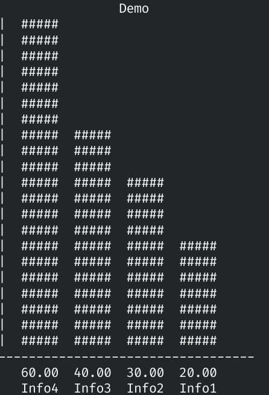
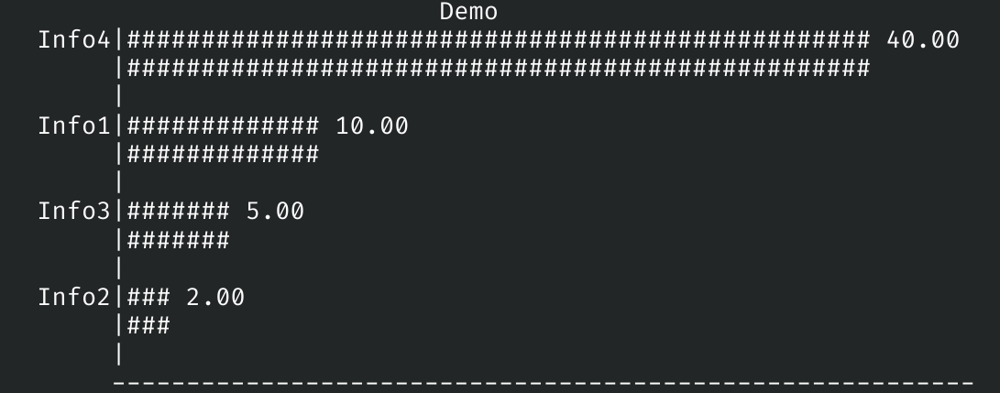

# Graficos-em-C
Projeto para a construção de gráficos no terminal utilizando a linguagem C

Este projeto tem como objetivo testar a construção de elementos visuais pelo terminal, além da familiarização com a sintaxe de argumentos na execução de um programa.

## USO

Sintaxe:

```
testeGraficos [argumento] [tituloDoGrafico] [numeroDeLinhas]
```

Argumentos suportados: -e (exportar como um arquivo), (-i (inserir dados na execucao) , -d (demo)) WIP

## Exemplos

<div style= "display:flex; gap: 10px;">

<div style= "display: flex; flex-direction: column; width: 100%;">

<p> Exemplo de gráfico de barras</p>
</div> 

<div>

<p> Exemplo de gráfico de linhas</p>
</div>

</div>


